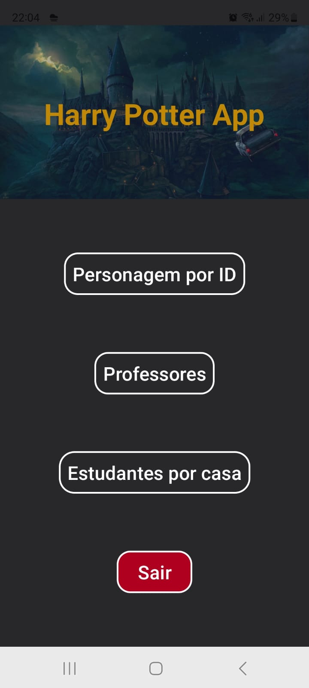
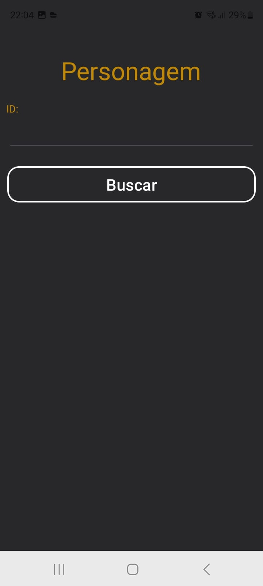
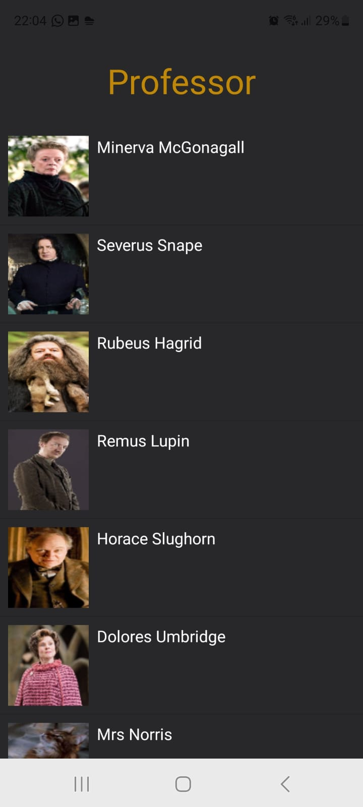
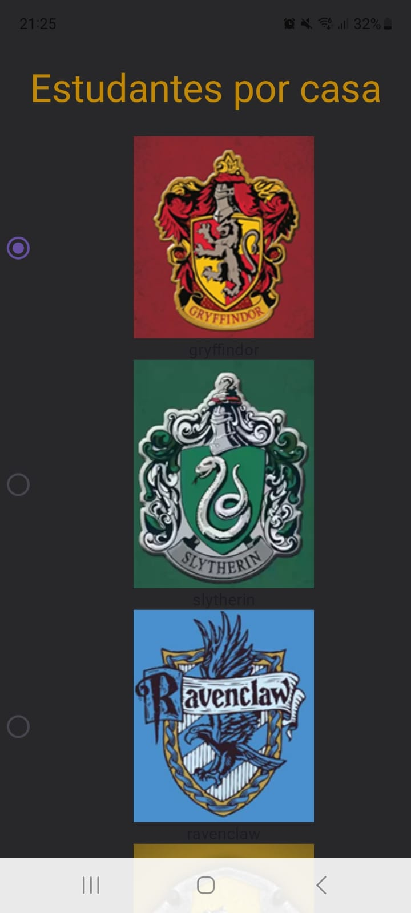
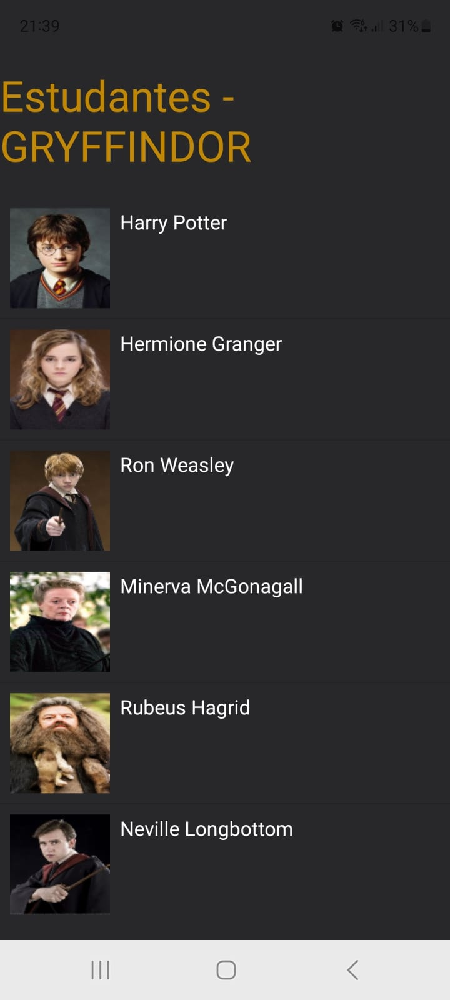

## Sobre o projeto

Projeto desenvolvido para a disciplina de Desenvolvimento Mobile 2 na especialização em Desenvolvimento Ágil de Software da UFPR. Neste projeto está desenvolvido um aplicativo para dispositivos android que contenham o sistema operacional a partir da versão 28.

### Tecnologias

Para desenvolver este projeto foram utilizadas as seguintes tecnologias:

* Kotlin
* Constraint Layout
* View-Activity
* Retrofit
* Picasso
* Material Design
* HP-API (https://hp-api.onrender.com/)

### Imagens do aplicativo

#### Tela inicial

#### Tela para consultar personagens por ID

#### Tela para consultar professores

#### Telas para pesquisar estudantes por casa

